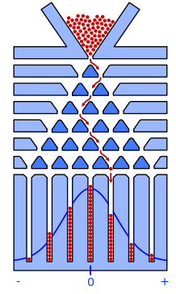
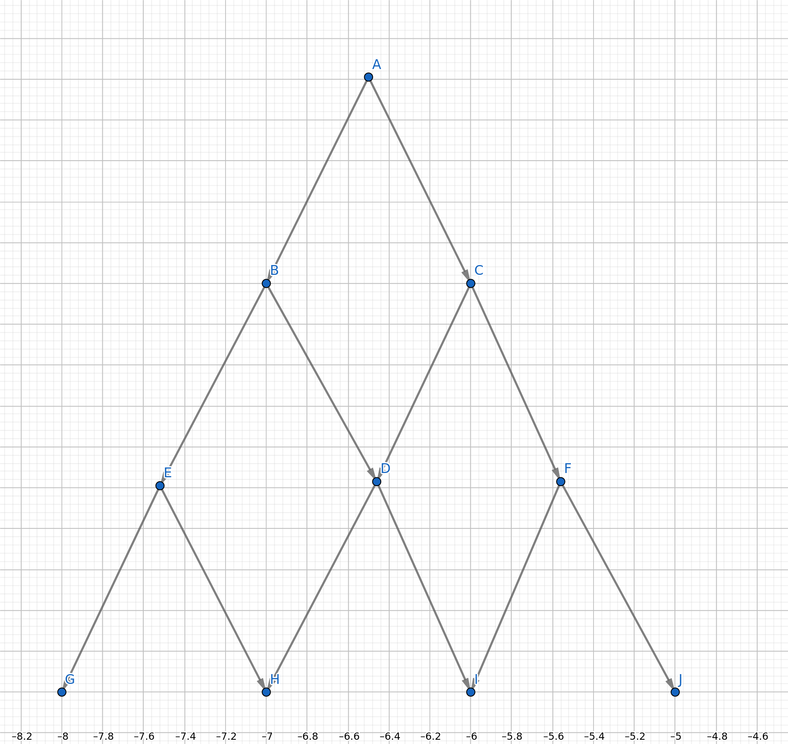
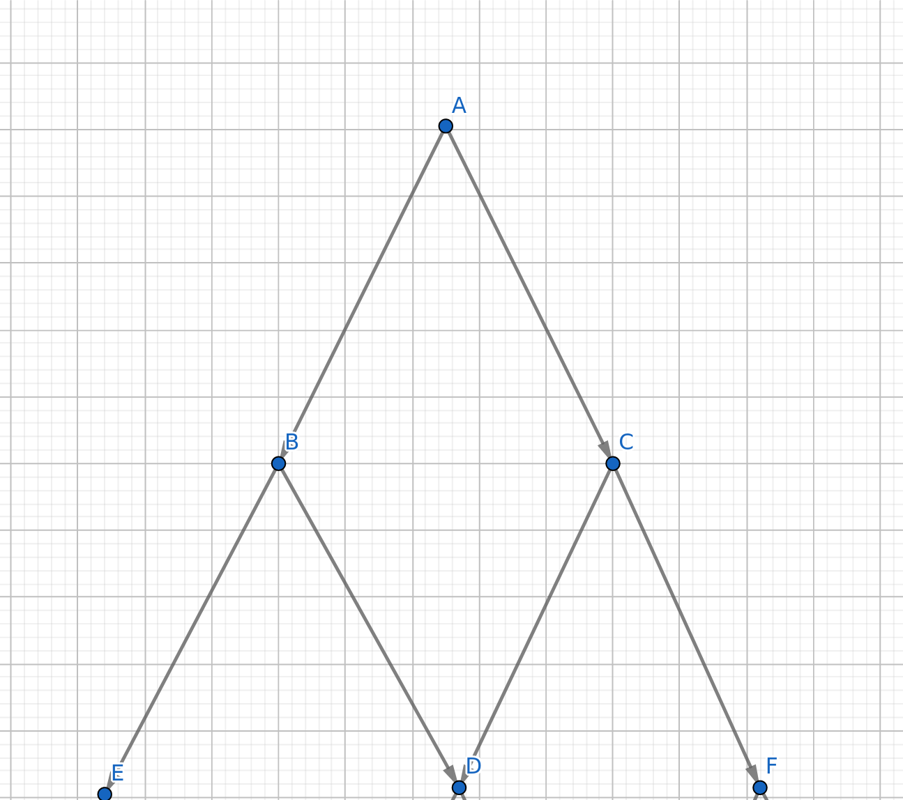

# Remarks  on counting 

- breaks down in non-uniform distributions.
- is entirely meaningless in the context of continuos probability.
    Consider this, what is the probability of picking $1.5$ randomly from the range $[1, 2]$. This results in $\frac{1}{\infty}$.
    Alternatively, consider the probability of picking something in the range $[1.5, 1.6]$ from the range $[1, 2]$. If we try to count here, we get $\frac{\infty}{\infty}$

\pagebreak
# Discrete probability, Galton Board, and Pascal's triangle

Consider the Galton board:



The fun part is that we can explain the bell curve using principles of counting alone (and the resulting probability).

The secret, emperically, lies in the number of paths leading to particular spoke, there are more paths leading to the centre than the edges.

To justify our claims, we'll use a tamer version of the board.
And we'll model it with a graph (it is more like a Directed Acyclic Graph).



Each node represents a junction.

It is assumed that at each junction, there is no bias as to which path will be taken next.

Consider the nodes B and C, we can easily see that the probability of being in either after one step is $\frac{1}{2}$ each because at A we could've made two equi-probable choices.

and for node D, the probability of being there after two steps is $\frac{1}{4} + \frac{1}{4}$

and so on, consider the diagram below, where each node has the probability of being there written.

```
            1
        1/2     1/2
    1/4     2/4     1/4
1/8     3/8     3/8     1/8 
```

the numerators use the pascal triangle.

Also a general formula is $\frac{{d \choose k}}{2^d}$ where $d$ is the depth.

As we can see from this, the centre nodes have the maximum probability.

## Random walks and matrix representation (cuz why not)

Note: I'll make the diagram smaller to demonstrate the recharacterization easily.



The figure provided to us can be represented by the matrix:

Assume the rows and columns are alphabetical.

$$
G = 
\begin{bmatrix}
    0 & 0 & 0 & 0 & 0 & 0 \\
    \frac{1}{2} & 0 & 0 & 0 & 0 & 0  \\
    \frac{1}{2} & 0 & 0 & 0 & 0 & 0  \\
    0 & \frac{1}{2} & \frac{1}{2} & 0 & 0 & 0  \\
    0 & \frac{1}{2} & 0 & 0 & 0 & 0  \\
    0 & 0 & \frac{1}{2} & 0 & 0 & 0  
\end{bmatrix}
$$

and entry $i,\ j$ represents the probability of going from $j$ to $i$ _in one step_.

Let us consider a vector of the probability of being on a particular node at an instant to be

When we begin, we're at $A$ with a 100\% certainty thus 

$$
v_0 = 
\begin{bmatrix}
    1 \\
    0 \\
    0 \\
    0 \\
    0 \\
    0 
\end{bmatrix}
$$

let us consider the $v$ after one step to be $v_1$, it can be seen that 

$$
v_1 = G \cdot v_0
$$

everytime we apply the transform $G$ we get the vector for the next state.

therefore, we can generalise to 

$$
v_t = G^t \cdot v_0
$$

Thus the answer of the actual problem can be obtained by getting the step after $2$ steps.

$$
\begin{aligned}
    v_2 = &
    \begin{bmatrix}
        0 & 0 & 0 & 0 & 0 & 0 \\
        \frac{1}{2} & 0 & 0 & 0 & 0 & 0  \\
        \frac{1}{2} & 0 & 0 & 0 & 0 & 0  \\
        0 & \frac{1}{2} & \frac{1}{2} & 0 & 0 & 0  \\
        0 & \frac{1}{2} & 0 & 0 & 0 & 0  \\
        0 & 0 & \frac{1}{2} & 0 & 0 & 0  
    \end{bmatrix}
    \cdot 
    \begin{bmatrix}
        0 & 0 & 0 & 0 & 0 & 0 \\
        \frac{1}{2} & 0 & 0 & 0 & 0 & 0  \\
        \frac{1}{2} & 0 & 0 & 0 & 0 & 0  \\
        0 & \frac{1}{2} & \frac{1}{2} & 0 & 0 & 0  \\
        0 & \frac{1}{2} & 0 & 0 & 0 & 0  \\
        0 & 0 & \frac{1}{2} & 0 & 0 & 0  
    \end{bmatrix}
    \cdot 
    v_0 \\
    & = 
    \begin{bmatrix}
        0 & 0 & 0 & 0 & 0 & 0 \\
        0 & 0 & 0 & 0 & 0 & 0 \\
        0 & 0 & 0 & 0 & 0 & 0 \\
        \frac{1}{2} & 0 & 0 & 0 & 0 & 0 \\
        \frac{1}{4} & 0 & 0 & 0 & 0 & 0 \\
        \frac{1}{4} & 0 & 0 & 0 & 0 & 0 \\
    \end{bmatrix}
    \cdot
    v_0 \\
    & = 
    \begin{bmatrix}
        0 \\
        0 \\
        0 \\
        \frac{1}{2} \\
        \frac{1}{4} \\
        \frac{1}{4} \\
    \end{bmatrix}
\end{aligned}
$$


Thus we have the highest probability of being at $D$ and it is $\frac{1}{2}$

This rephrasement gave us the same output.

The advantage of rephrasing it this way is that it's versatile because we can apply this method to any graph with no change.

Also since it most involves powers of a matrix, the whole thing can be optimized by using binary exponentiation and fast matrix multiplication methods.


Also, it's damn fucking cool. (all hail Professor Girish)

Funnily enough _any decision problem_ can be modeled this way because _any set of decisions_ can be modeled as a graph.


# Model of Discrete Probability 

- Sample spaces are either discrete or continuos
- in discrete models, probability of events is obtained by adding corresponding outcomes.
- in continuos models, it is obtained by inegration.

For discrete models, the sample space $S$ must be a countable set.

$S = \{s_1, s_2 \dots \}$

for an event $A \subset S$

$$
P(A) = \sum _{s_i \in A} P(s_i)
$$


