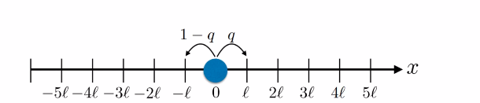
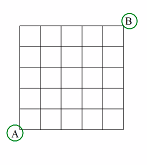
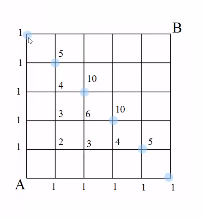

# Random walk 

## Simple random walk in 1 D
- A walks is called a simple random walk in 1D if there is an equal probability of either going to the right or the left 

question: what is the probability it is somewhere after the ith step 

We draw a choice tree (like the Galton Board)

We're gonna use a matrix later.

Use a decision tree 
ez

### Question: Get the probability to come back to $0$ at the $i^{th}$ step

(left as assignment)

## Random walks in 2D

- Alice can go only right or up
- Bob can go only left or down
- probability that they meet?

- at each turn, they _have_ to make a move.

Notice that to meet, they'll need to have taken five steps each.

That implies a diagonal. As Vamshi visualized

So viable points:

How many ways to reach each of the points?

it will ${5 \choose n_h}$ where $n_h$ is the number of possible horizontal steps to that point.

Note, they're like binomial coefficients. 

Number of ways for Bob and Alice to reach a particular point in the diagnoal is the same.

So the next question is what is the total number of way Alice and Bob can meet? 

For each point, we need to multiply the number of ways for each person, thus we have ${5 \choose n_h}^2$

We do this for all the points and sum them all, because any of the points on the diagonal is fair game.

also, total number of ways they move across the field: is $2^5 \times 2^5$ (since we let the game go only for $5$ moves)

# Conditional probability

## Motivation 

- Experiment: throw two dice $A$ and $B$ simulteneously 

- Event: odd number on the first die 
- Question: what is the probability of the event E?

(simple case, we don't care)

- Event Odd number on the first die A, given that even shows on die B

- Question: what is the probability of event $E$

Note: in this case the events are independent of each other (reasonable assumption) so the condition doesn't matter much 

but the difference in perspective is that now my sample space is smaller ( and so is the favorable event cardinality ). The sample is now only concerned with events in which B is even. 

So, we can more generally say 

$$
P(A | B) = \frac{P(A \cap B)}{P(B)}
$$

where $P(A|B)$ means probability of $A$ given $B$ has already been observed.

## Definition of conditional probability 

The _conditional probability_ of $E$ given $F$ is the probability that $E$ occurs given that $F$ has already occured.

- denoted by $P(E|F)$
- It means P(E given F was observed)
- Sample space is all possible outcomes that are consistent with $F$ i.e. $S \cap F$
- Events is all outcomes consistent with $F$ _and_ (with $E$) thus, the new event becomes $E \cap F$

Thus the probability becomes: 

$$
P(A | B) = \frac{P(A \cap B)}{P(B)}
$$

## Law of total Probability 

$$
P(E | F) = P\frac{E \cap F}{p(F)} \Rightarrow P(E \cap F) = P(F)P(E|F`  )
$$

### Theorem

$$
P(E) = P(E|F)P(F) + P(E|F^c)P(F^c)
$$

Proof:

$$
P(E|F)P(F) = P(E \cap F)
$$

and

$$
P(E|F^c)P(F^c) = P(E \cap F^c)
$$

Note that $(E \cap F^c) \cup (E \cap F) = \phi$ and therefore they are mutually excplusive 

thus 

$$
P((E \cap F^c) \cup (E \cap F)) =  P(E \cap F^c) + P(E \cap F)
$$

$$
\Rightarrow P(E) = P(E \cap F^c) + P(E \cap F)
$$

$$
\Rightarrow P(E) = P(E|F)P(F) + P(E|F^c)P(F^c)
$$

Done

