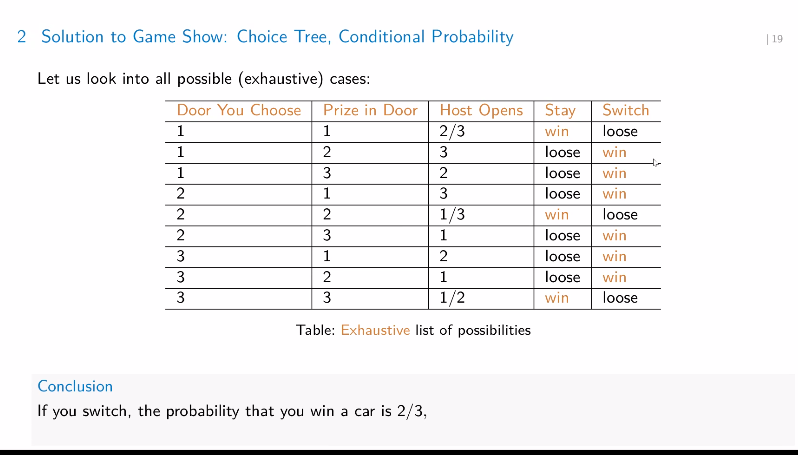

## Motivation of baye's theorem 

Consider this: 
- We can easily calculate the probability of having the word "dear" given I know it is spam
- baye's theorem allows

# Baye's theorem

For any events $E$ and $F$ where $P(E) > 0$ and $P(F)>0$

$$
P(E|F) = \frac{P(F|E) P(E)}{P(F)}
$$

Why does this work?

$P(E|F) P(F) = P(F \cap F)$

and by definition we know that $P(E|F) = \frac{P(E \cap F)}{P(F)}$

Further expansion can happen 

$$
P(E) = (P(E|F) P(F) + P(E|F^c) P(F^c))
$$

## Monty Hall problem statement 

- there are three doors
- one door leads to a car, the other two leads to goats.
- you can pick a door _without_ opening it 
- then host opens a door 
- if the host always opens a goat door, is it wise to change the door.

The decision of changing choice feels like a 0.5 chance and that it hardly matters.

### Exhaustive counting solution

\pagebreak

### Bayes theorem solution 

- Let $H$ be the hypothesis "door 1 has a car behind it" and $E$ is the evidence that Monty has revealed a door with a goat behind it. 

- Then problem can be restated as finding the value of $P(H|E)$ because that will determine the decision of switching. 

$$
P(H) = \frac{1}{3}
$$

$$
P(H^c) = 1 - \frac{1}{3} = \frac{2}{3}
$$

$$
P(E) = 1
$$

Also, 

$$
P(E | H) = 1
$$

(Note: $P(E)$ and $P(E | H) = 1$ are $1$ because we know that the host will always open a door with the goat, no matter what.)

By Bayes theorem we can say that 

$$
\begin{aligned}
    P(H | E) & = \frac{P(E | H) P(H)}{P(E)} \\
    & = \frac{1 \cdot P(H)}{1} \\
    & = P(H) \\
    & = \frac{1}{3}
\end{aligned}
$$

This basically tells us that no matter the evidence, the probability I had chosen the right door the first time, doesn't change. Meaning that the chance that I picked the right door is $\frac{1}{3}$. Thus it is more likely that my door is wrong. Since one door has been removed from commission, we can say that the left door has a $\frac{2}{3}$ probability of having a car.

Note: you don't have to pick door one the first time round, you can pick any without the loss of generality for the proof.

### Modified version of the problem 

Note: from now on I will be using the $\bar{H}$ notation for $H$ compliment.

This section will address the modified version of the problem as seen in the monsoon quiz

Or rather my understanding of the new problem statement.

It is now said that the host opens the door randomly, and has opened one to show you (the participant) a goat. 

given that this is the situation, what should the participant do?

I will use the same variables and events as the original version of the problem to make the comparison clearer.

- Let $H$ be the event that the participant had originally picked a car door.
- Let $E$ be the evidence that Monty (the host) has shown a goat door.

Now the problem, like before can be reduced to finding out $P(H | E)$

by Bayes theorem: 

$$
P(H | E) = \frac{P(E | H) P(H)}{P(E)}
$$

we can see that $P(H) = \frac{1}{3}$ (like before)

we need $P(E | H)$ That is the probability the host opens a goat door given the participant had originally picked a car. Note that since the participant had originally picked a car, the other two door _must have a goat_ behind them each thus the host shows a goat no matter what and therefore: 

$$
P(E | H) = 1
$$

Now, we need $P(E)$

By law of total probability we have:

$$
P(E) = P(E | H)P(H) + P(E | \bar{H}) P(\bar{H})
$$

the only element we don't know in above equation is $P(E | \bar{H})$. This is basically the probability of the host showing a goat, given that the participant has chosen an a goat door. In this situation, the leftover doors have one car and one goat behind them each and the host doesn't know which is which and therefore the events of a goat being picked and a car being picked are equally likely.

$$
P(E | \bar{H}) = \frac{1}{2}
$$

This is where the _real_ difference from the original version of the problem comes in.

Anyway, substituting relevant values for $P(E)$, we get 

$$
\begin{aligned}
    P(E) & = P(E | H)P(H) + P(E | \bar{H}) P(\bar{H}) \\
    & = 1 \cdot \frac{1}{3} + \frac{1}{2} \cdot \frac{2}{3} \\
    & = \frac{2}{3}
\end{aligned}
$$

substituting relevant values into the relation for $P(H | E)$ we get.

$$
\begin{aligned}
    P(H | E) & = \frac{P(E | H) P(H)}{P(E)} \\
    & = \frac{1 \cdot \frac{1}{3}}{\frac{2}{3}} \\
    & = \frac{1}{2}
\end{aligned}
$$

so in this case it doesn't matter what the participant does now. 

