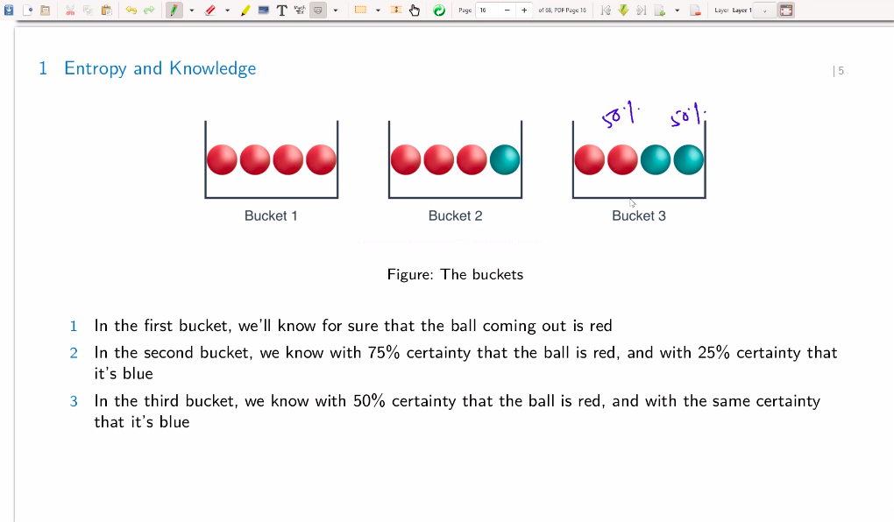
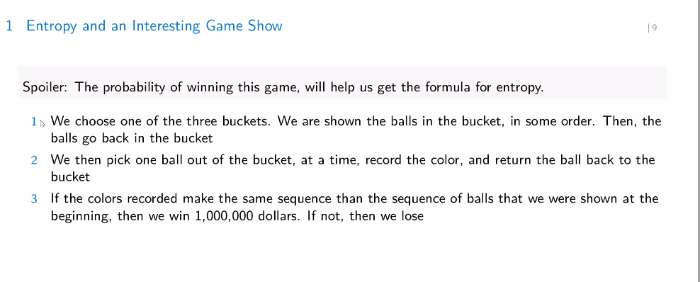
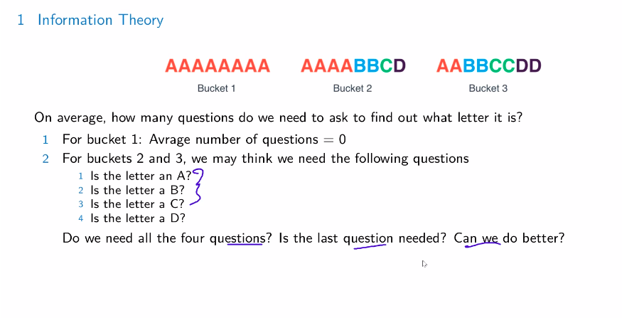
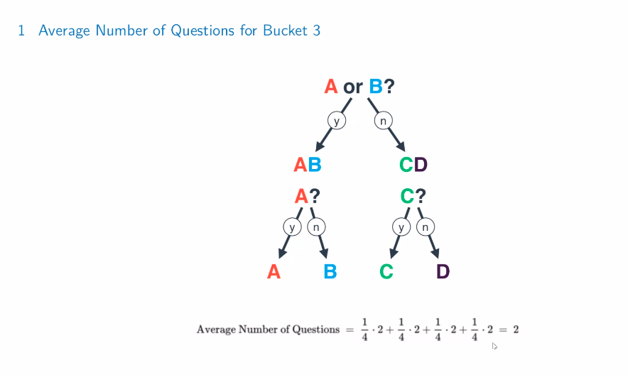

# Information theory 

- "A Mathematical Theory of Communication" - Claude Shannon

# Entropy of physics 

(in a shitty way)

Entropy: log of the number of microstates and micrscopic configurations 

1. If particles in a system have many possible configs then the system has high entropy 

2. rigid systems have low entropy 

solids have low entropy 

gases have high entropy

# Entropy and knowledge 

1. Bucket 1 gives us the amount of "knowledge" about the ball we'll draw cuz we know that the ball will be red 

and so on 

"Knowledge" is in some way contrary to entropy 

# Quantifying entropy using probability 

From physics we can go on to say that systems with more possible rearrangements corresponds to higher entropy 

(and low for low )

## Game show timez

So in the second case the probability of winning is 

$$
0.75 \times 0.75 \times 0.75 \times 0.25 = 0.105
$$

because the balls get put back, each pick is independent of the other 

and the  winning sequence is the intersection of all those events (and thus multiplication )

## Towards Entropy Formula 

We want something opposite of the probability formulae. 

Steps: 

1. Take $\log$ that turns everything to a summation 
2. multiply with $-1$ and we get the nice property we want 

thus we have 

(for the second case )

$$
- \log_2 0.75 - \log_2 0.75 - \log_2 0.75 - \log _2 0.25 = 3.245
$$

(this isn't the actual formula now )

# The entropy formula: 

$$- \sum_{i=1} ^n p_i \log_2 p_i$$ 

where $n$ is the number of elementary events 

# Computer science view 

Note: how much can I reduce the number of bits to, to get the same amount of information 

## Information Theory 

now we ask 

1. is the letter A or B?
    a. If answer is yes: is the letter A? if the answer is no: then is it C? ( done)
    b. If no: then is it A?

So at most two questions are good enough 

The thing looks like a decision tree 

For bucket 2

TODO: get something more concrete 

