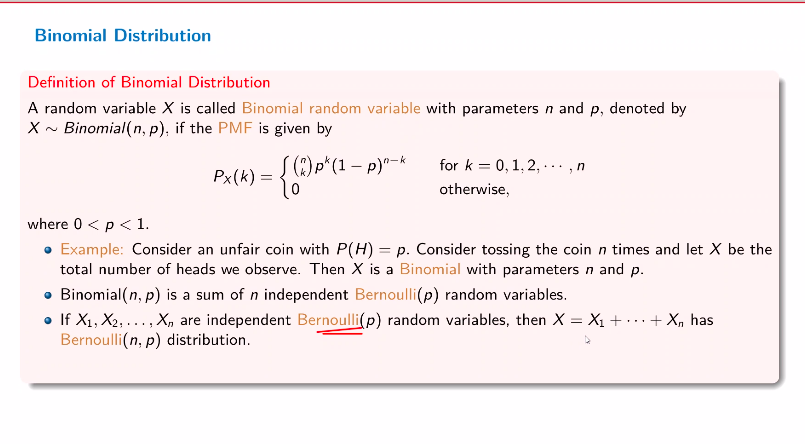

## Expectation of a function of random variable

$$
E[g(X)] - \sum _x g(x) p(x)
$$

## Saint Petersberg Paradox 

Rules: 

- toss a fair coin, if it is heads, the game ends and the players wins Rs. 2 

- if tails, then toss happens again and if it is heads in the second toss, then player wins Rs. 4

- if tails again you continue 

- if the head arrives at the nth turn then you win $2^n$

in other words, 

let $X$ be the random variable representing earnings

$$
E[X] = \sum _{i=1} ^\infty (0.5)^i \cdot 2^i
$$

series does not converge 

The problem is that theoretically we should be willing to pay an arbitrarily large sum to play the game 

but that is horrible, no one would do it 

so why?

### Analysing the paradox 

At any point, the chances of you losing money is 

$$
\frac{1-(0.5)^i}{0.5}
$$

# Bernoulli distribution 

A random variable $X$ is called a Bernoulli random variable with parameter $p$, denoted by $X \sim \text{Bernouli(p)}$

Say we have an event that can only have two outcomes: success or failure, if we have $X = 1$ then we have a success and $x=0$ is failure 

$$
\begin{aligned}
    & P\{X=0\} = 1 - p \\
    & \Rightarrow P \{X=1\} = p 
\end{aligned}
$$

Then it is a bernouli variable 

# Geometric Distribution 

A random variable $X$ is called a geometric random variable with parameter $p$, denoted by $X \sim \text{Geometric}(p)$ if its PMF is given by 

$$
P_X(k) =
\begin{cases}
    p(1-p)^{k-1} & \text{for} k = 1, 2, \dots \\
    0 &
\end{cases}
$$

# Binomial distribution 

it's like the number of successes are represented by the random variable 

Also we could say that bernoulli distribution is kinda like a special case of this 

$$
\text{Bernoulli}(1, p): \\
P_X(k) = 
\begin{cases}
    {1 \choose k} p^k (1 - p)^{n-k} & \text{for } k = 0, 1 \\
    0 & \text{otherwise}
\end{cases}
= 
\begin{cases}
    1-p & k=0 \\
    p & k=1
\end{cases}
$$

# Poisson distribution 

A random variable $X$ that takes on one of the values $0, 1, \dots$ is said to be a _poisson_ random variable with parameter $\lambda$ if, for some $\lambda > 0$

$$
P\{X=i\} = e^{- \lambda} \frac{\lambda^i}{i!}, \ \forall i=0, 1, 2 \dots 
$$

We can say that this is a proper probability mass function because: 

$$
\sum _{i=0} ^\infty P(X=i) = e^{-\lambda} \sum _{i=0} ^\infty \frac{\lambda ^i}{i!} = e^{- \lambda} e^{\lambda} = 1
$$

The Poisson random variable has great usage in approximation of binomial random variables such that $n$ is large and $p$ is small 

why? 

Consider the binomial distribution with parameters $(n, i)$: 

$$
P(\{X=i\}) = {n \choose i} p^i (1 - p)^{n-i}
$$

What is $n \to \infty$? 

also let $\lambda = pn$

We're saying that $p$ is small and $n$ is really large. This distribution works as an approximation 

thus we kinda treat $\lambda$ as a constant  

$$
\begin{aligned}
    \lim _{n \to \infty} {P(\{X=i\})} &= \lim _{n \to \infty} {n \choose i} p^i (1 - p)^{n-i} \\
    & =  \lim _{n \to \infty} {\frac{n!}{(n-i)!i!} p^i (1-p)^{n-i}} \\
    &= \lim _{n \to \infty} {\frac{n!}{(n-i)!i!} \Big( \frac{\lambda}{n} \Big)^i \Big( 1 - \frac{\lambda}{n} \Big)^{n-i}} \\
    &= \lim _{n \to \infty} \frac{n(n-1)\dots(n-i+1)}{n^i} \frac{\lambda ^i}{i!} \frac{(1 - \frac{\lambda}{n})^n}{(1 - \frac{\lambda}{n})^i}
\end{aligned}
$$

And 

$$
\lim _{n \to \infty} \Big(1 - \frac{\lambda}{n} \Big)^n = e^{-\lambda}
$$

$$
\lim _{n \to \infty} \frac{n(n-1)\dots (n-i+1)}{n^i} = 1
$$

$$
\Big(1 - \frac{\lambda}{n} \Big)^i = 1
$$

$$
P\{X=i\} = e^{-\lambda} \frac{\lambda ^i}{i!}
$$

## Example 

Given that there are on average 5 requests for a car rise per minute from a certain area. What is the probability of $k$ requests from this area in next 1 minute 

key idea: we will distribute time into discrete chunks 

so break a minute into 60 second; each second is independent trial with a requst or no request 

let $X: \text{ number of requests in a minute}$

and given that 

$E[X] = \lambda = 5$ which is equal to $np$ where $p$ is the probability of a request 
and $n$ is the number of discrete chunks

then we will extend $n$ to infinity (generalizing and ignoring the example )

Derivation: 

$$
P(X=k) = \lim_{n \to \infty} {n \choose k} \Big(\frac{\lambda}{n} \Big)^k \Big(1 - \frac{\lambda}{n} \Big)^{n-k}
$$

## Poisson distribution 

